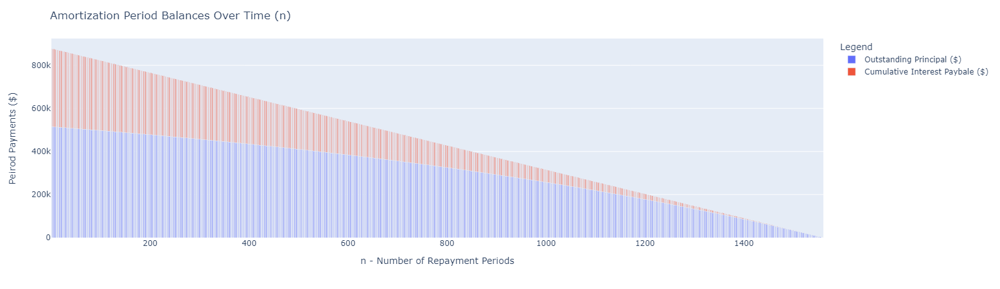
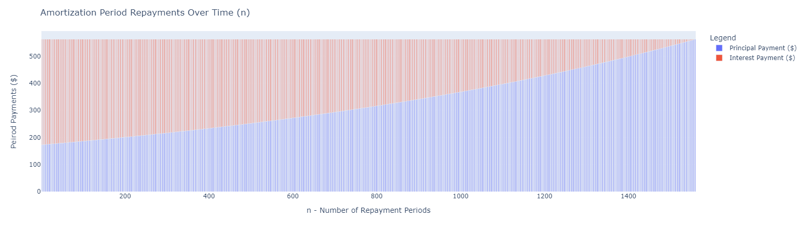

# Examples

## Example 1:
```python
import AmortaPy as ap

input_interest_rate = 0.0394
input_loan = 515000
input_years = 30
input_repayment_method = 'weekly'
loan = ap.generate_amortization_schedule(input_interest_rate, input_loan, input_years, input_repayment_method)

```
```python
loan
```
...<i>output..</i>
<h1>Amortization Schedule</h1>
<table>
    <tr>
        <th>Principal Borrowed</th>
        <th>Years</th>
        <th>Annual Interest Rate</th>
        <th>Forecasted Total Interest</th>
    </tr>
    <tr>
        <td>$515,000.00</td>
        <td>30</td>
        <td>3.94%</td>
        <td>$363,147.47</td>
    </tr>
    <tr>
        <th>Repayment Frequency</th>
        <th>Minimum Repayments Per Peirod</th>
        <th>Effective Annual Interest Rate (EAR)</th>
        <th>Total Interest / Total Principal</th>
    </tr>
    <tr>
        <td>Weekly - 1,560 Periods</td> 
        <td>$562.92</td>
        <td>4.02%</td>              
        <td>70.51%</td>
    </tr>
</table>

To visualize the Amortization Schedule in a graph you will need to manually install `plotly-express`

```shell
pip install plotly-express
```

```python
loan.period_balances_chart # Requires plotly-express
```
...<i>output..</i>


```python
loan.period_repayments_chart  # Requires plotly-express
```
...<i>output..</i>
