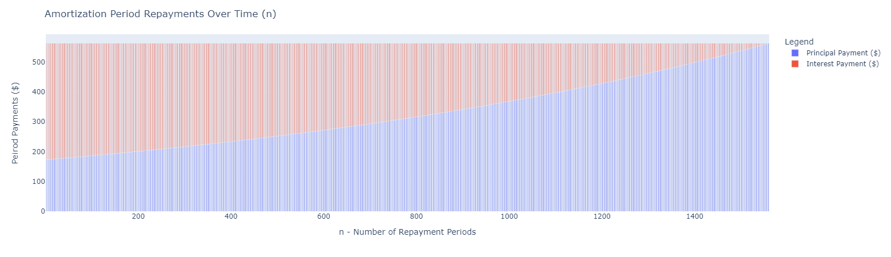

# AmortaPy
## <i>Convenient Amortization Schedule Calculations</i>
## About
`AmortyPy` is built on top of `pandas` and `plotly-express`
* `Pandas` is used to display the amortization table as a `DataFrame` and allow for futher data analysis and manipulation.
* `plotly-express` provides a useful interactive graph for visualizing and interacting with the data.  
* I developed the package as a way for me to easily model and visualize my mortage homeloan. 

### <i><b>Disclaimer</b>
* The package is used to model and provide an informational analysis. 
* This package does not provide financial advice. Loan decsions should consider other external factors and should not be made on this model alone. 
* AmortaPy does not accept any liability for decisions made based on its use.
</i>

# Quick Start
<b>Checkout the [Docs folder](./Docs) for example notebooks</b>
## Install AmortaPy
Currently only available via Github install.
```shell
pip install git+https://github.com/b3mery/AmortaPy.git
```
## Generating a Amortization Table DataFrame:
* Amortization DataFrame
    ```python
    import AmortaPy as ap

    input_interest_rate = 0.0394
    input_loan = 515000
    input_years = 30
    repayment_freq = 12 # monthly

    period_int_rate = input_interest_rate/repayment_freq
    periods = input_years*repayment_freq

    df = ap.generate_amortization_table(period_int_rate, input_loan, periods)
    ```
* Amortization DataFrame with additional payments per peirod 
    ```python
    df = ap.generate_amortization_table(period_int_rate, input_loan, periods, additional_payment_per_period=50)
    ```
## Generatating an Amortization Object
* Create an amortization schedule
    ```python
    import AmortaPy as ap

    input_interest_rate = 0.0394
    input_loan = 515000
    input_years = 30
    input_repayment_method = 'weekly'

    loan = ap.generate_amortization_schedule(input_interest_rate, input_loan, input_years, input_repayment_method)
    ```

* Get a quick summary
    ```python
    loan # if in Jupyter Notebook
    print(loan) # if in Python file/cmd
    ```

* Tap into the amortization table dataframe
    ```python
    loan.amortization_schedule.head()
    ```

* Use the Setter Methods to recalculate the schedule. Setters default to `inplace` updates. Meaning the instance will be updated. If you want to reterive a copy set `inplace=False`
    ```python
    # Update the years of the Amortization object and preview the table head again
    loan.set_years(20).amortization_schedule.head()

    # Update some attribute and have a new object returned
    loan2 = loan.set_nominal_annual_interest_rate(0.045, inplace=False)
    ```
* AmortaPy Classes support dot notation. This means you can chain commands
    ```python
    loan2.set_nominal_annual_interest_rate(0.028).set_repayment_frequency_periods('monthly')
    ```
* Like how the `inplace` argument of `False` returns a copy of the object you can also explicitly create a copy. 
    ```python
    loan3 = loan.copy()
    ```
## Graph Visualization
To visualize the Amortization Schedule in a graph you will need to manually install `plotly-express`
```shell
pip install plotly-express
```
* Once installed you can simply tap into the `figure` properties.
    ```python
    loan.period_balances_chart.show()
    ```
    

    ```python
    loan.period_repayments_chart.show()
    ```
    

* You can also create a stacked graph manually using the `plot_stacked_bar_chart` API which is was created to be reusable with the Amortization class. 
* More custom graphs should be created using `plotly` or `plotly-express` directly